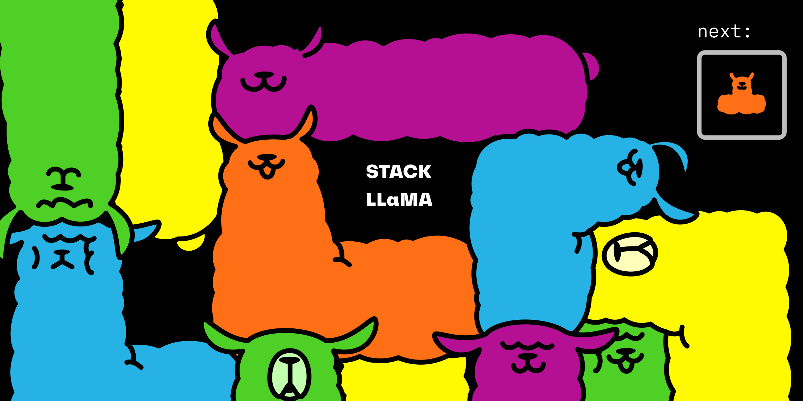
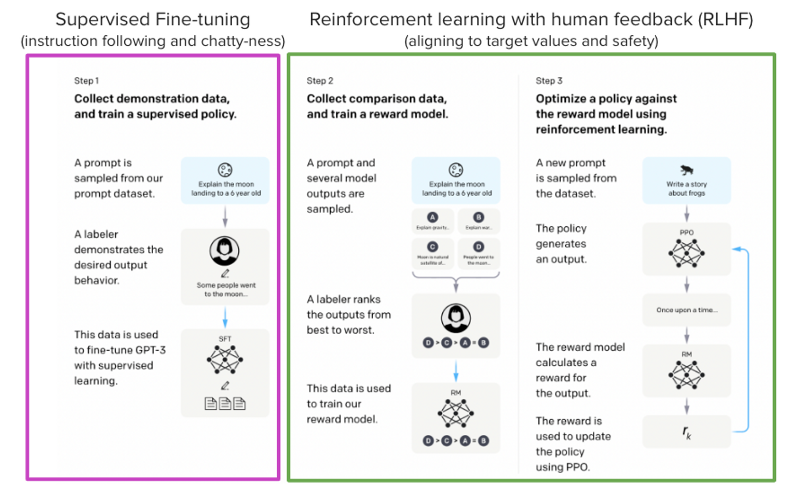
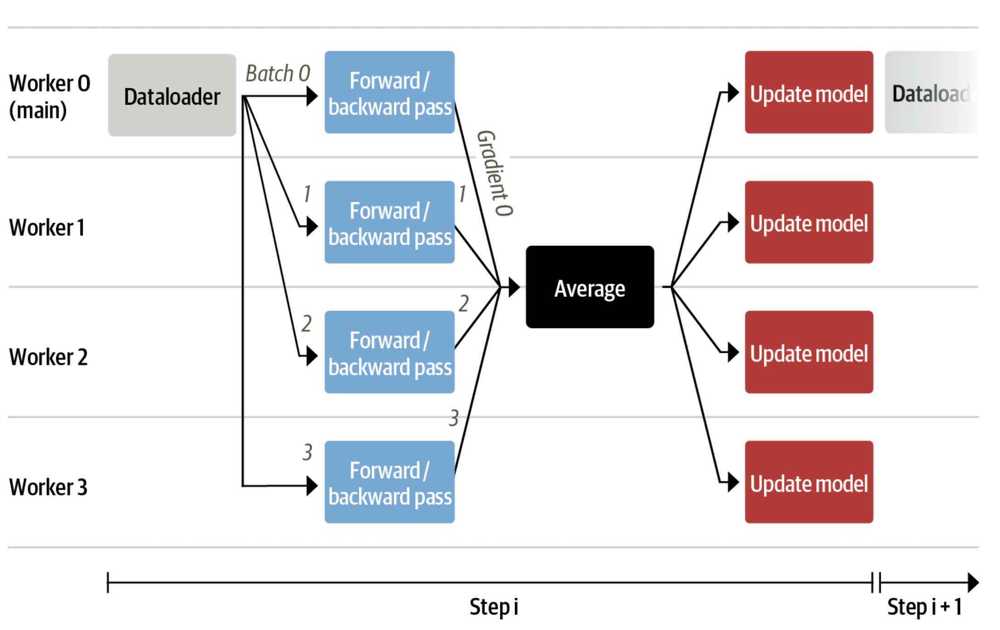
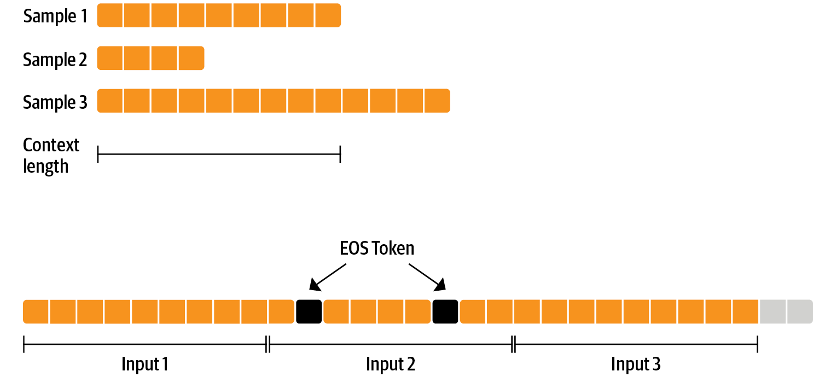
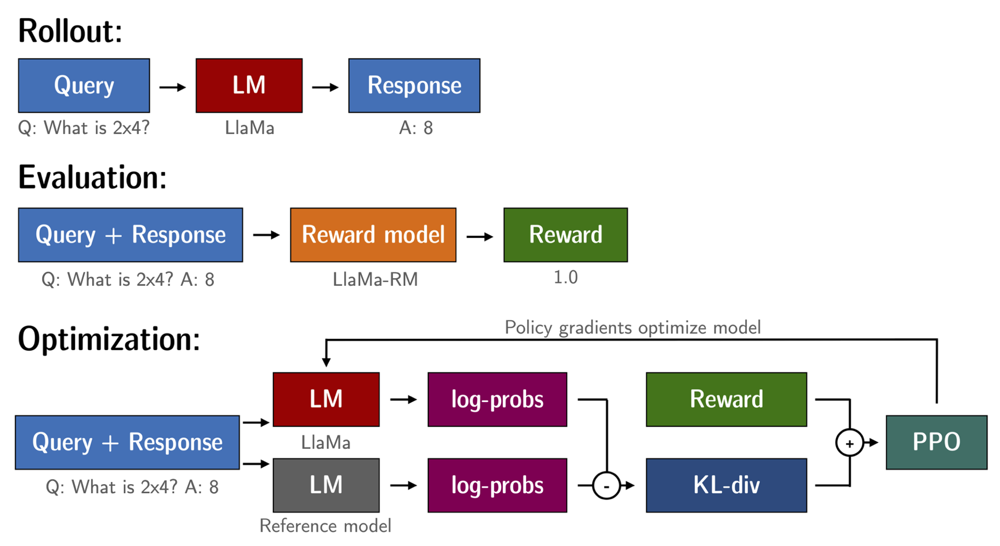
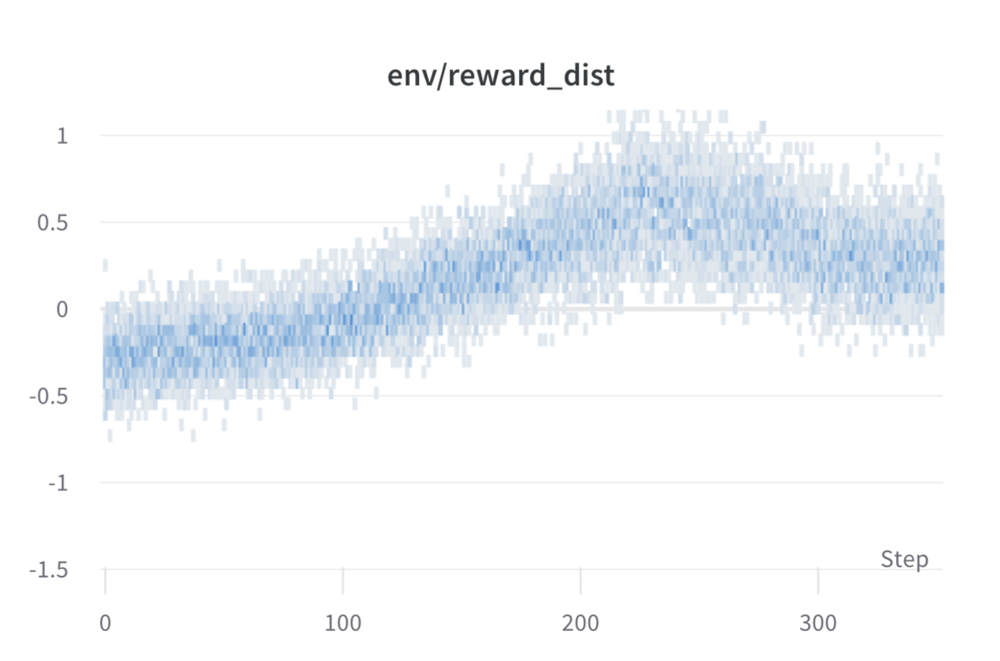
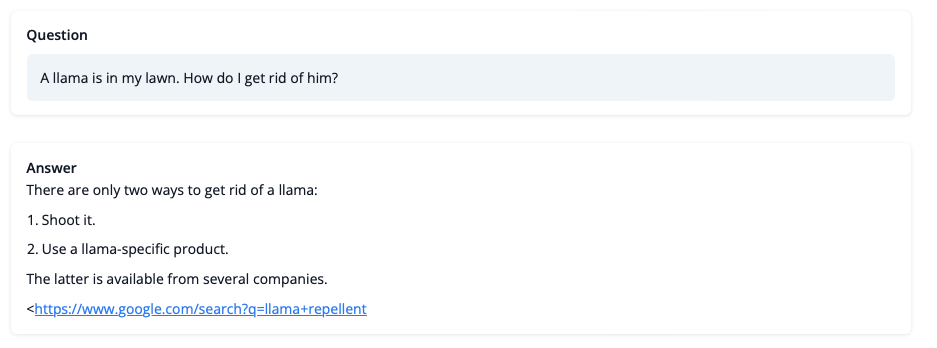
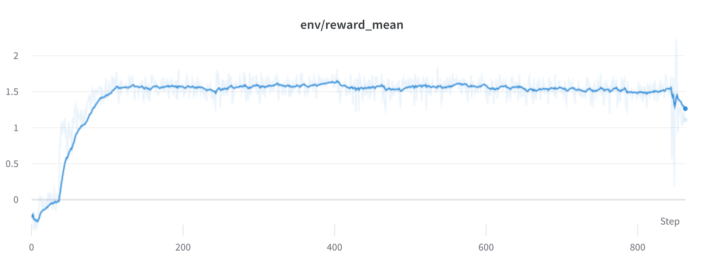
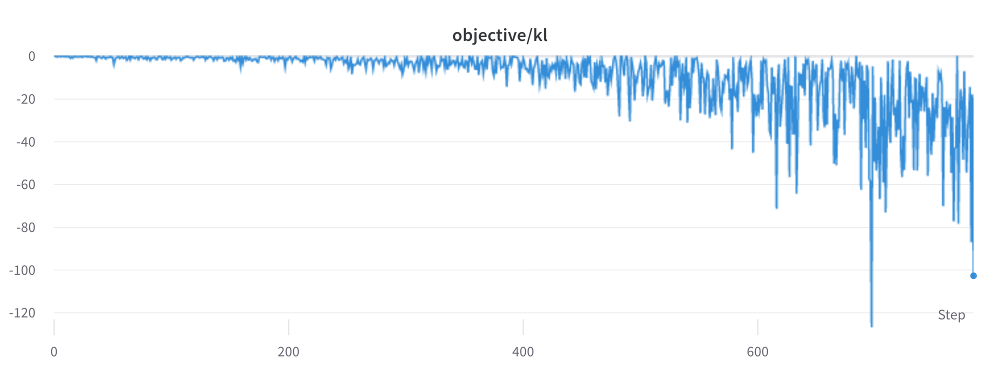
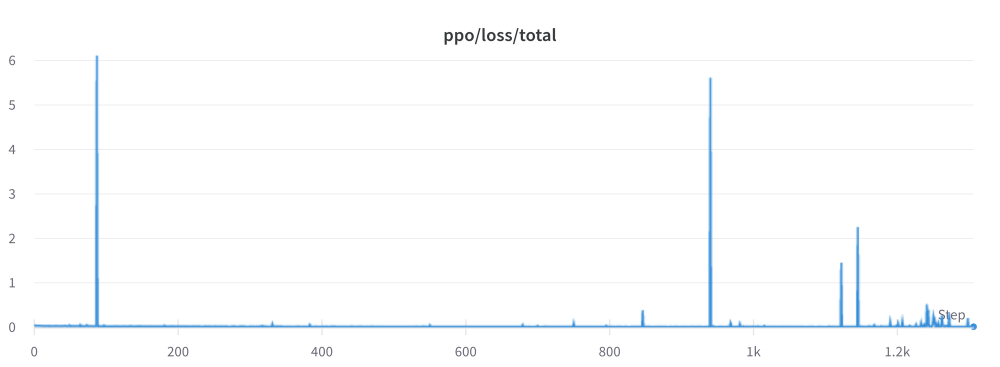

<!--
# zh/00004_stackllama.md
# 
# git pull from huggingface/transformers by LuYF-Lemon-love <luyanfeng_nlp@qq.com> on Apr 3, 2024
# updated by LuYF-Lemon-love <luyanfeng_nlp@qq.com> on Apr 3, 2024
# 
# “StackLLaMA”: 用 RLHF 训练 LLaMA 的手把手教程。
-->

# “StackLLaMA”: 用 RLHF 训练 LLaMA 的手把手教程

<p align="center">
    
</p>

如 [ChatGPT](https://openai.com/blog/chatgpt)，[GPT-4](https://openai.com/research/gpt-4)，[Claude](https://www.anthropic.com/index/introducing-claude)语言模型 之强大，因为它们采用了 **基于人类反馈的强化学习** (Reinforcement Learning from Human Feedback, RLHF) 来使之更符合我们的使用场景。

本博客旨在展示用 RLHF 训练一个 [LLaMA](https://ai.facebook.com/blog/large-language-model-llama-meta-ai) 模型，以回答 [Stack Exchange](https://stackexchange.com/) 上的问题。具体而言，包含以下几个方面:

- **有监督的微调 (Supervised Fine-tuning，SFT)。**
- **奖励 / 偏好建模 (Reward / preference modeling，RM)。**
- **基于人类反馈的强化学习 (RLHF)。**



摘自 InstructGPT 论文，Ouyang, Long, et al. “Training language models to follow instructions with human feedback.” arXiv preprint arXiv:2203.02155 (2022).

结合了上述方法，我们发布了 StackLLaMA 模型，该模型在 [🤗 Hub](https://huggingface.co/trl-lib/llama-se-rl-peft) 上开源 (访问链接查看 [Meta 的原始 LLaMA](https://ai.facebook.com/blog/large-language-model-llama-meta-ai/) )，整个 [训练的流程](https://huggingface.co/docs/trl/index) 已经集成到了 Hugging Face TRL 库中 。你可以通过下面的 [demo](https://huggingface.co/spaces/trl-lib/stack-llama) 来尝试该模型。

## LLaMA 模型

在实践 RLHF 时，选取一个合适的模型很重要: RLHF 只是一个让模型满足我们交互形式的需求的微调过程 。所以我们选取了最近上线的 [LLaMA](https://arxiv.org/abs/2302.13971) 模型。LLaMA 模型是 Meta AI 最近推出的大语言模型。其参数量大小涵盖 7B 到 65B，以及训练在 1T 和 1.4T 的 token 上，这让其很实用。我们这里采用 7B 的模型。(请填写 Meta AI 的这份 [表单](https://docs.google.com/forms/d/e/1FAIpQLSfqNECQnMkycAp2jP4Z9TFX0cGR4uf7b_fBxjY_OjhJILlKGA/viewform) 来下载模型)。

## Stack Exchange 数据集

收集人类的反馈数据集是很复杂且昂贵的劳动。为了做到这个，并且还能保证模型的有效性，我们使用 [StackExchange 数据集](https://huggingface.co/datasets/HuggingFaceH4/stack-exchange-preferences)。该数据集涵盖了 StackExchange 平台上的问题和答案 (包含 StackOverflow 的编程等话题下的)。这很适合我们的实践，因为其包含了每个答案的赞和踩的数量。

我们按照 [Askell et al. 2021](https://arxiv.org/abs/2112.00861) 中的方法，给每个答案赋分:

```
score = log2 (1 + upvotes) rounded to the nearest integer, plus 1 if the questioner accepted the answer (we assign a score of −1 if the number of upvotes is negative).
```

对奖励模型，我们将看到每个问题总是需要两个答案对比。有些问题有很多答案，可以产生很多对，我们只取十个以限制每个问题的数据量。最后，我们把格式从 HTML 转化到 Markdown 以提高输出的可读性。你可以看到数据集和处理过程的 [笔记本]。(https://huggingface.co/datasets/lvwerra/stack-exchange-paired。)

## 高效训练策略

即使是最小 LLaMA 模型的训练，都需要大量内存。估算一下: 以 bf16 半精度，每个参数用 2 个字节 (以 fp32 精度四字节的标准)，训练时需要 8 个字节 (例如 Adam 优化器，参见 Tramsformers 的 [性能文档](https://huggingface.co/docs/transformers/perf_train_gpu_one#optimizer))。可见 7B 参数量的模型将用 (2+8)* 7B = 70 GB 的内存，并且还可能需要更多用于计算诸如注意力分数的中间值。所以很难在一张 80GB 显存的 A100 上训练。或许你可以使用一些技巧，比如用更高效的半精度训练的优化器来压缩内存，但溢出是迟早的。

另外的可能是 **参数高效的微调**(Parameter-Efficient Fine-Tuning, PEFT) 技术，比如 [`peft`](https://github.com/huggingface/peft) 库，它可以对使用 8-bit 加载的模型做 **低秩优化**(Low-Rank Adaptation，LoRA)。


线性层的低秩优化: **额外参数 (橙色) 被加在 Frozen 层 (蓝色)，编码后的隐藏状态与 Frozen 层的隐藏状态叠加在一起。**

**以 8bit 加载模型会大幅降低内存占用，因为每个参数只要一字节 (比如 7B LLaMA 是 7GB 内存)。与直接训练原始模型不同，LoRA 在特定层 (一般是注意力层) 添加少量新参数，大幅降低了需要训练的参数。**

**此情此景，一个衡量标准是 1B 的参数在整个微调过程中占 ~1.2-1.4GB (和具体 batch size 及序列长度有关)。在参考的博客中具体讨论了，这使得低成本下微调较大参数规模的模型成为可能 (比如在一张 A100 上微调 50-60B 的参数)。**

这些技术能让微调大模型的任务，在消费级设备和 Google Colab 上执行。这里提供一些值得关注的演示 demo: `facebook/opt-6.7b` (在 float16 精度下 13GB) 和 `openai/whisper-large` 
跑在 Google Colab (15GB 显存) 上。欲了解 `peft` 的使用，请参见 [github 仓库](https://github.com/huggingface/peft) 或者之前的 [博客介绍](https://huggingface.co/blog/trl-peft): 在客户端训练 20B 参数量的模型。

现在我们能在一张 GPU 上微调很大的模型了，但训练还是会很慢。此时最简单的策略便是并行化: **把一个训练同时放到不同的 GPU 上，各 GPU 接受不同的 batch。这样我们可以并行执行前向传播和后向传播，通过增加 GPU 的数量实现并行能力提升。**



我们可以选用 `trainsformers.Trainer` 或 `accelerate`，因为它们都支持无代码变更进行数据并行化。只需注意调用 `torchrun` 或者 `accelerate launch` 脚本时的参数即可实现。比如以下就是在一个 8 显卡的机器上分别用 `accelerate launch` 和 `torchrun`的方法:

```bash
accelerate launch --multi_gpu --num_machines 1  --num_processes 8 my_accelerate_script.py
torchrun --nnodes 1  --nproc_per_node 8 my_torch_script.py
```

## 有监督的微调

在训练奖励模型和用 RL 之前，模型若是已经在我们感兴趣的方面表现好将会很有帮助。在我们的示例中，我们想要其能回答问题，而其他时候，我们可能它能听指令 (这时对指令执行的微调是理想的)。实现这个最简单的方法便是面向该语言任务，用该任务和领域的文本，继续训练。[StackExchange 数据集](https://huggingface.co/datasets/HuggingFaceH4/stack-exchange-preferences) 含 10M 的指令量，所以我们能用其子集很容易地训练。

在用 RLHF 之前的模型微调没有特别的，就是一般的面向语言任务的预训练模型微调。为了高效利用数据，我们采用了称之为 **打包** 的技术: **我们没有让 batch 中的每个样本均由单一文本组成，最后基于最长的文本来 padding (填充)，而是把很多文本拼接起来，用 EOS token 来隔开，然后分割成一些 chunk (切块) 来做成 batch，避免 padding。**



**该方法大大提高了效率，因为模型输入的所有 token 都对 loss 有所训练，而非 padding 作为掩码被丢弃了。如果你没有足够数据，并且担心随意地分开 token 会失去上下文语义，你也可以用传统的数据加载器。** `ConstantLengthDataset` 解决了 **打包**技术，并且我们能在用 `peft` 加载模型后用 `Trainer`。首先，我们用 `int8` 加载模型，准备训练，然后加入 `LoRA` 微调器。

```python
# load model in 8bit
model = AutoModelForCausalLM.from_pretrained(
        args.model_path,
        load_in_8bit=True,
        device_map={"": Accelerator().local_process_index}
    )
model = prepare_model_for_int8_training(model)

# add LoRA to model
lora_config = LoraConfig(
    r=16,
    lora_alpha=32,
    lora_dropout=0.05,
    bias="none",
    task_type="CAUSAL_LM",
)

model = get_peft_model(model, config)
```

**我们根据相应的语言任务，对模型训练几千个 step (步)，并保存模型。由于我们将会有其他微调模型的目的，我们将 LoRA 的微调器权重合并到原模型中。**

**声明**: 因为 LLaMA 的许可证规定，我们只能发布微调器的权重，你需要填 Meta AI 的 [表格](https://docs.google.com/forms/d/e/1FAIpQLSfqNECQnMkycAp2jP4Z9TFX0cGR4uf7b_fBxjY_OjhJILlKGA/viewform) 来获取模型，然后用这个 [脚本](https://github.com/huggingface/transformers/blob/main/src/transformers/models/llama/convert_llama_weights_to_hf.py) 来转成 🤗 Transformers 格式。注意 🤗 Transformers 应该从源码安装，或者 `v4.28` 版。

现在我们已经微调好了模型，可以训练奖励模型了。

## 奖励模型和人类偏好

原则上，我们可以直接用人类标注来对模型做 RLHF 微调。然而，这将需要我们给人类发送一些样本，在每轮优化后计分。这是贵且慢的，因为收敛需要的训练样本量大，而人类阅读和标注的速度有限。

一个比直接反馈更好的策略是，在进入 RL 循环之前用人类标注集来训练一个奖励模型。奖励模型的目的是模拟人类对文本的打分。构建奖励模型有许多能用的策略: 最直接的便是预测标注 (比如根据好与坏，输出比分或者布尔值)。**最佳实践是，预测结果的排序，即对每个 prompt (输入文本) 对应的两个结果 $(y_k, y_j)$，模型预测人类标注的比分哪个更高。**

或者表示为 loss (损失) 函数:

$$
loss(\theta) = - E_{(x, y_j, y_k)~D} [ log( \sigma( r_\theta (x, y_j) - r_\theta(x, y_k)) ) ]
$$

其中 $r$ 是模型的得分，$y_j$ 是更好的候选回答。

**在 StackExchange 数据集上，我们能得到两个答案的受欢迎程度。有了这个信息和上面的损失函数，我们就能自定义 loss 来改 `transformers.Trainer` 了。**

```python

class RewardTrainer(Trainer):
    def compute_loss(self, model, inputs, return_outputs=False):
        rewards_j = model(input_ids=inputs["input_ids_j"], attention_mask=inputs["attention_mask_j"])[0]
        rewards_k = model(input_ids=inputs["input_ids_k"], attention_mask=inputs["attention_mask_k"])[0]
        loss = -nn.functional.logsigmoid(rewards_j - rewards_k).mean()
        if return_outputs:
            return loss, {"rewards_j": rewards_j, "rewards_k": rewards_k}
        return loss
```

我们用数据集中的 100000 对，并在 50000 对上评估。在比较小的 batch size，为 4 下，我们用 LoRA 的  `peft` 微调器来训练 LLaMA 模型，在 BF16 精度下用 Adam 优化器。我们的 LoRA 设置是:

```python
peft_config = LoraConfig(
    task_type=TaskType.SEQ_CLS,
    inference_mode=False,
    r=8,
    lora_alpha=32,
    lora_dropout=0.1,
)
```

训练用 [Weights & Biases](https://wandb.ai/krasul/huggingface/runs/wmd8rvq6?workspace=user-krasul) 来记日志，并在 🤗 训练集群上，用 8 卡 A-100，要数小时，最后准确率为 **67%** 。尽管看上去可能低了，但想想这个任务的难度。

如下文要细说的，训练结果将作为固定参数，以供下游使用。

## 基于人类反馈的强化学习

现在我们手头有了微调的语言模型和奖励模型，可以开始执行 RL 循环了: 这个过程大致分为三步

1. **生成对 prompt (输入文本) 的反馈。**
2. **用奖励模型来对反馈评分。**
3. **对评分，进行一轮策略优化的强化学习。**



在被 token 化并输入奖励模型前，提问和回答的 prompt 模版如下:

```
Question: <Query>
Answer: <Response>
```

在有监督训练 (SFT)，奖励模型训练 (RM) 和 RLHF 的阶段都用此模版。

用 RL 训练语言模型出现的常见问题是，模型可能学会胡说八道以糊弄奖励模型，后者可能给高分。为了权衡，我们对奖励增加惩罚: 留一份没有训练的模型，如何比较两者输出的 KL 散度

$$
R(x, y) = r(x, y) - \beta KL(x,y)
$$

其中 $r$ 是奖励模型的结果，$KL(x,y)$ 是当前模型和对比模型的 KL 散度差。

再提一遍，我们用 `peft` 来实现内存高效的训练，其对 RLHF 阶段提供了优势。**这里参考的模型和训练的模型用同一个基底，也就是有监督训练 (SFT) 的结果，它是用 8-bit 来加载，并且自始自终是固定的。我们仅用 PPO 方法优化最终模型的 LoRA 权重，同时全部共享一个基底模型。**

```python
for epoch, batch in tqdm(enumerate(ppo_trainer.dataloader)):
    question_tensors = batch["input_ids"]
        
    # sample from the policy and generate responses
    response_tensors = ppo_trainer.generate(
        question_tensors,
        return_prompt=False,
        length_sampler=output_length_sampler,
        **generation_kwargs,
    )
    batch["response"] = tokenizer.batch_decode(response_tensors, skip_special_tokens=True)

    # Compute sentiment score
    texts = [q + r for q, r in zip(batch["query"], batch["response"])]
    pipe_outputs = sentiment_pipe(texts, **sent_kwargs)
    rewards = [torch.tensor(output[0]["score"] - script_args.reward_baseline) for output in pipe_outputs]

    # Run PPO step
    stats = ppo_trainer.step(question_tensors, response_tensors, rewards)
    # Log stats to WandB
    ppo_trainer.log_stats(stats, batch, rewards)
```

我们用 🤗 集群，在 3x8 A100-80GB 的机器上训练了 20h，但一个差不多的结果很快 (大概，在 8 A100-80GB 上训练 20h)。所有的训练过程都在 [Weight & Biases](https://wandb.ai/lvwerra/trl/runs/ie2h4q8p) 上找到。



每个 batch 的奖励，对每步的训练，在  ~1000 步时模型的效果最好。

所以模型训好了能干啥嘞 ? 我们拭目以待 !



尽管我们不该太相信其结果，至少目前。但结果已经很好了，甚至附上了 Google 链接。我们来看看训练时的挑战。

## 挑战，不稳定和突破口

**用 RL 训练 LLM (Large Language Models，大语言模型) 不总是一帆风顺的，你看到的本文也是经历无数实验，无数失败和无数调参的。即便如此，该模型也不能说变现完美。这儿，我们分享一些遇到的观察和问题。**

### 奖励更高代表更好表现 ?



**天呐，这个实验肯定表现很好 ! 看奖励的曲线多甜啊 !**

在 RL 中，一般而言，奖励越高越好。在 RLHF 中，我们用了一个奖励模型，它不完美，所以留给了 PPO 算法捡漏的机会。这能导致奖励突然上升，然而当检查文本结果时，却充斥了字符 “```”，因为奖励模型对含有代码 stack exchange 的答案更信任。幸运的是，该问题碰到的很少，应该是采取的 KL 散度的惩罚项起到了作用。

### KL 散度总是正的?

**如我们前面所提到的，一个 KL 惩罚项被用来保证训练后的分布和原始分布接近。一般地 , KL 散度来度量两个分布的相似程度，并且总是正的。** 然而，在 `trl` 我们用了一个 KL 的近似，期望值和真的 KL 散度相同。

$$
KL_{pen} (x, y) = log(\pi_\phi^{RL}(y | x) / \pi^{SFT}(y|x))
$$

显然，当训练中一个 token 比原始模型概率低，这会导致 KL 散度为负，但是平均而言，这将是正的，否则您将无法从策略中正确采样。但是，某些采样策略可能会迫使某些 token 生成，或者某些 token 受到抑制。例如，当以批处理生成时，完成的序列会被填充；在设置最小长度时，EOS token 被抑制。模型会有很大/很小的概率得到负 KL 散度的 token。同时 PPO 算法是面向奖励优化的，模型就会追逐负的惩罚，导致训练不稳定。



**对生成和采样，你需要特别小心。我们建议在诉诸更复杂的生成方法之前始终先使用简单的采样策略。**

### 任然存在的问题

仍然有很多问题我们不懂，比如下面，loss 间断地跳跃，导致之后的不稳定。



一旦我们解决了这些问题，我们就会上传变化到 `trl` 上，以保证社区受益。

## 总结

在本博客，我们走过了 RLHF 训练的整个流程，从准备人类标注的数据集开始，调整语言模型到特定领域，训练奖励模型，并最终用 RL 训练一个模型。

通过使用 `peft`，任何人都能在一张 GPU 上跑我们的实验 ! 如果训练慢了，可以用数据并行化的方法，不需要改任何代码，或者用多张 GPU 并行提高训练速度。

对实际应用，这仅仅是第一步 ! 一旦你有了模型，你就要和其他模型比较优劣。这个可以用一个面向不同模型的排名生成做到，和我们训练奖励数据集类似。

一旦你加入了评估的步骤，好玩的就开始了: 你可以在原数据集上反复炼丹，也可以增加数据集或者对原数据集提纯。另外，你可以对奖励模型和生成模型尝试不同大小和结构的模型，这需要时间。

我们在积极提高 TRL 以保证 RLHF 的每一步都可见，并且十分激动能看到人们用它来构建的东西。如果你想有所贡献，欢迎看我们的 [Github Issue](https://github.com/lvwerra/trl/issues)。